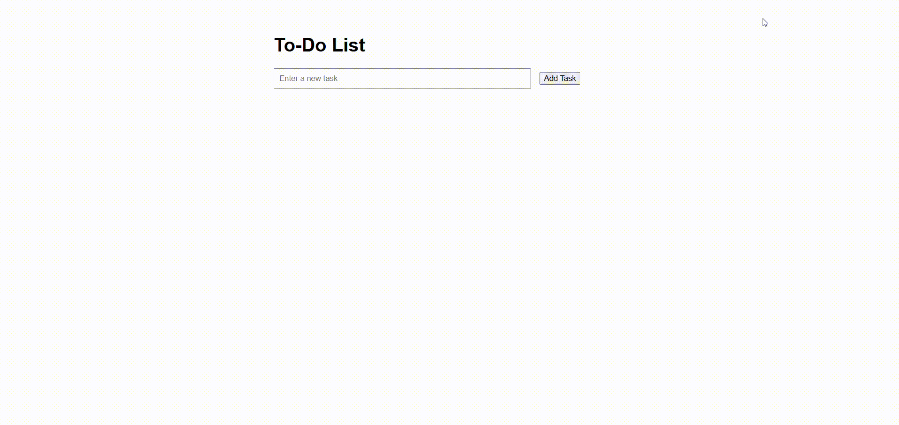

#  Interactive To-Do List Application

Create a simple to-do list app where users can add new tasks, mark them as complete, and remove them.

## Requirements
- Use DOM manipulation to create, update, and delete list items.
- Attach event listeners for adding tasks and toggling their completion status.
- Optionally store tasks in an array (or even in localStorage for persistence).

## Demo
Below is a GIF demonstrating the given tasks:

