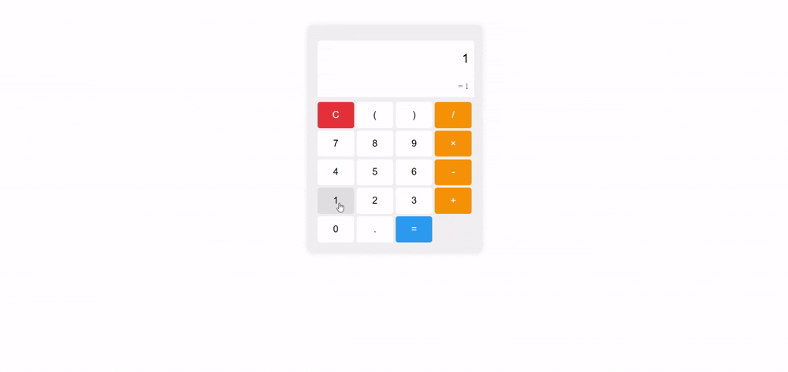

#  Simple Calculator

Build a basic calculator that performs arithmetic operations like addition, subtraction, multiplication, and division.

## Requirements
- Create number and operator buttons in HTML.
- Use JavaScript to capture user input and perform calculations.
- Update the display dynamically as the user interacts with the calculator.

## Demo
Below is a GIF demonstrating the given tasks:

