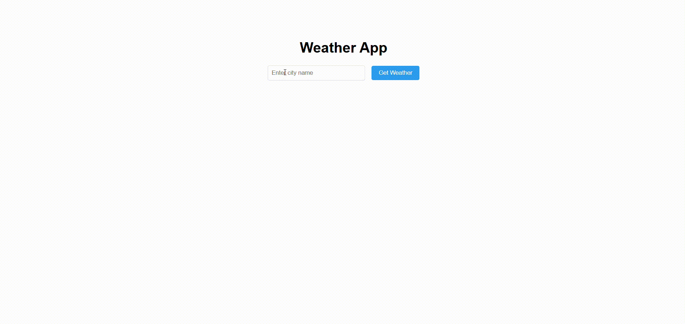

#  Weather App with API Integration

Create a weather app that fetches and displays weather information based on a city name input.

## Requirements
- Use the Fetch API to retrieve weather data from a public API (e.g., OpenWeatherMap).
- Parse the JSON response and update the DOM with temperature, humidity, and weather conditions.
- Implement error handling for invalid input or failed network requests.

## API used
- open meteo

## Demo
Below is a GIF demonstrating the given tasks:

