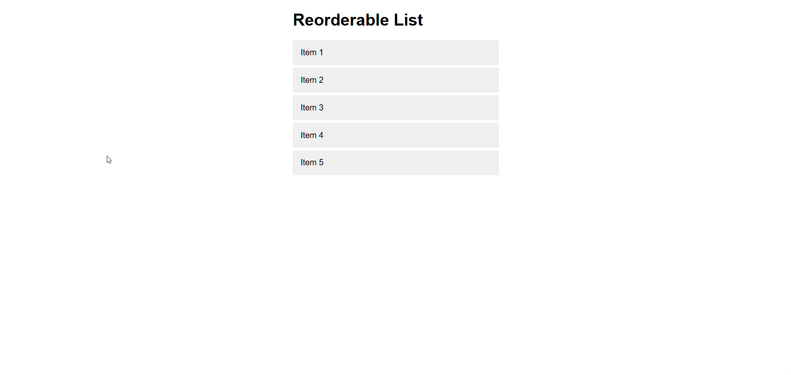

#  Drag and Drop List Reordering

 Implement a list that allows users to reorder items using drag and drop functionality.

## Requirements
- Leverage the HTML5 Drag and Drop API to manage drag events.
- Update the DOM to reflect the new order of items after a drop.
- Provide visual feedback during drag operations (e.g., highlight potential drop targets).

## Demo
Below is a GIF demonstrating the given tasks:

