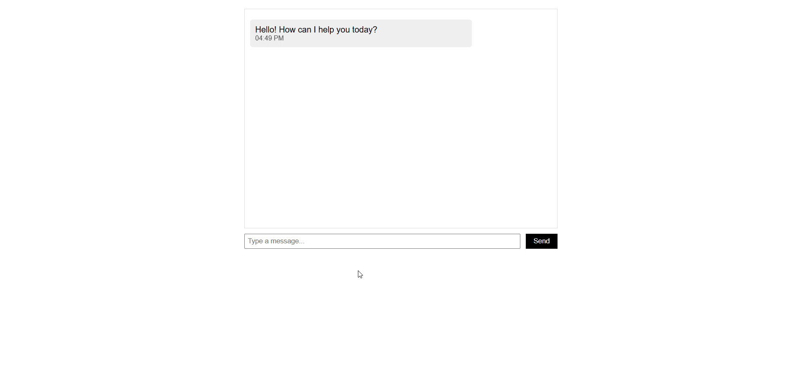

#  Real-time Chat Simulation

 Develop a chat interface that simulates real-time messaging without a backend.

## Requirements
- Create a chat window that displays messages as they are sent.
- Use setTimeout or setInterval to simulate incoming messages.
- Handle user input, display timestamps, and update the conversation dynamically.

## Demo
Below is a GIF demonstrating the given tasks:

